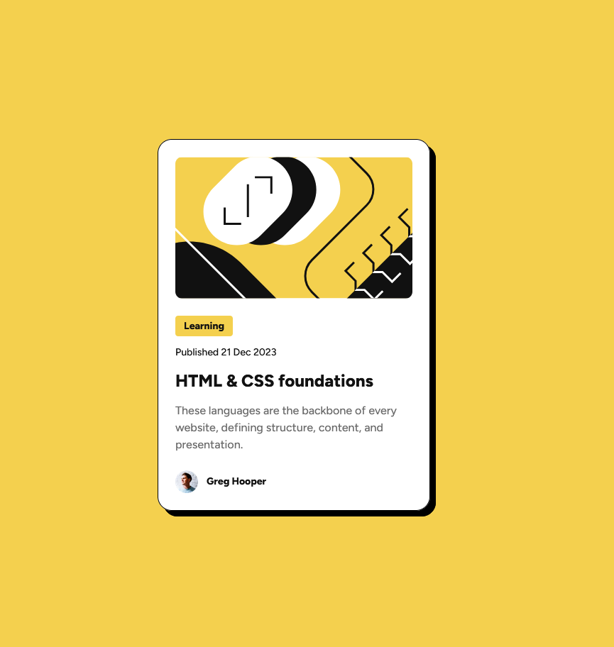

# Frontend Mentor - Blog preview card solution

This is a solution to the [Blog preview card challenge on Frontend Mentor](https://www.frontendmentor.io/challenges/blog-preview-card-ckPaj01IcS). Frontend Mentor challenges help you improve your coding skills by building realistic projects.

## Table of contents

-   [Overview](#overview)
    -   [Screenshot](#screenshot)
    -   [Links](#links)
-   [My process](#my-process)
    -   [Built with](#built-with)
    -   [What I learned](#what-i-learned)
    -   [Useful resources](#useful-resources)
-   [Author](#author)

**Note: Delete this note and update the table of contents based on what sections you keep.**

## Overview

### Screenshot

### Links

-   [Live Site](https://enricoelias.github.io/blog-preview-page/)

## My process

### Built with

-   Semantic HTML5 markup
-   CSS
-   Flexbox
-   Media query

### What I learned

-   Using basic HTML elements to structure a website
-   Using CSS selectors
-   Responsive Design using media query
-   Replicating figma design
-   Using CSS pseudo classes

### Useful resources

-   [CSS pseudo class :hover](https://developer.mozilla.org/en-US/docs/Web/CSS/:hover) - This helped me to implement the hover effect on the headline.
-   [CSS function drop-shadow()](https://developer.mozilla.org/en-US/docs/Web/CSS/filter-function/drop-shadow) - This helped me to implement the drop shadow on the card.

## Author

-   Frontend Mentor - [@EnricoElias](https://www.frontendmentor.io/profile/EnricoElias)
-   X - [@EnricoBuilds](https://x.com/EnricoBuilds)
